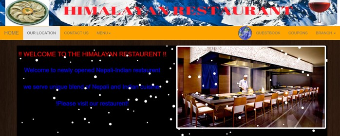

# Nepali_Restaurant
# Summary:
This is a simple website that is created to provide basic information about  nepali restaurant and it's services. Furthermore, I have developed this website from scratch. Here, I have used HTML5 to create the basic structure of the webpage, Css for layout and Javascript to chanage the behaviour of the website. 

Built Wwith:
1) Jacvascript
2) CSS
3) HTML5
4) Jquery
5) Bootstrap
6) Plugins
